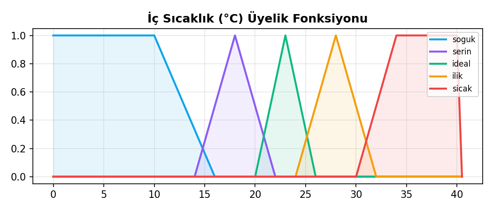
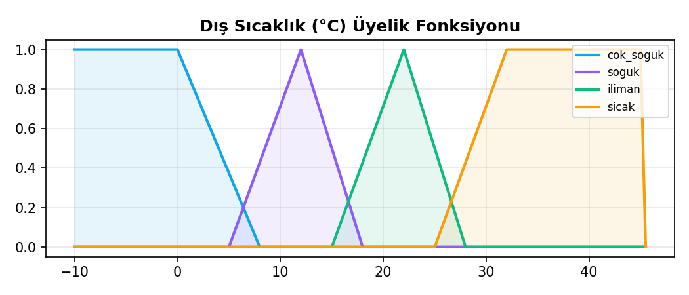
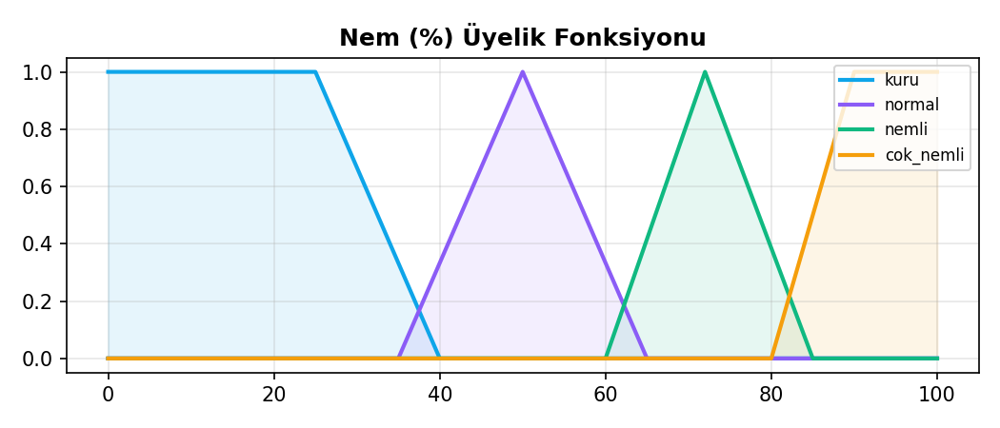
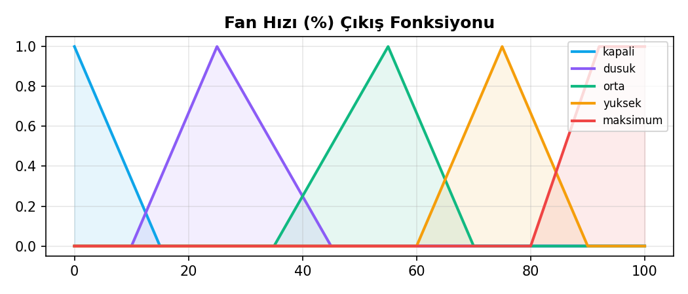
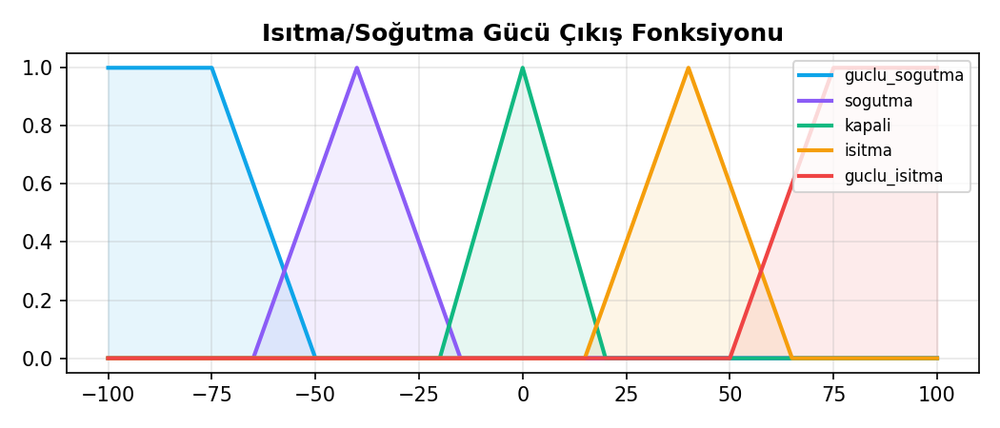

# BULANIK MANTIK DERSİ — DÖNEM PROJESİ RAPORU

## Akıllı Ev HVAC Sistemi: Bulanık Mantık Tabanlı İklimlendirme Kontrolcüsü

**Öğrenci:** Furkan Fatih Çiftçi
**Numara:** 22430070037
**Bölüm:** Bilgisayar Mühendisliği
**GitHub:** [github linki buraya]
**Tarih:** Mayıs 2026

---

## 1. GİRİŞ VE PROBLEM TANIMI

### 1.1 Problem

Modern akıllı evlerde HVAC (Heating, Ventilation, Air Conditioning — Isıtma, Havalandırma, Klima) sistemleri yıllık enerji tüketiminin **%40-60'ını** oluşturmaktadır. Klasik kontrolcüler (on/off, PID) genellikle:

- Tek değişkene (genelde sıcaklığa) bakar,
- Konfor algısının nem, kalabalık, günün saati gibi faktörlere bağlı olduğunu ihmal eder,
- Sert geçişlere ve enerji savurganlığına yol açar.

İnsan algısı ise *"oda biraz ılık ve kalabalık, ayrıca öğle vakti — fanı yükselt"* gibi **bulanık** ifadelerle karar verir.

### 1.2 Giriş ve Çıkış Değişkenleri

| Tip | Değişken | Birim | Aralık | Dilsel Terimler |
|---|---|---|---|---|
| **Giriş** | İç Sıcaklık | °C | 0–40 | soğuk, serin, ideal, ılık, sıcak |
| **Giriş** | Dış Sıcaklık | °C | -10–45 | çok_soğuk, soğuk, ılıman, sıcak |
| **Giriş** | Nem | % | 0–100 | kuru, normal, nemli, çok_nemli |
| **Giriş** | Kişi Sayısı | kişi | 0–10 | az, orta, çok |
| **Giriş** | Günün Saati | saat | 0–23 | gece, sabah, öğlen, akşam |
| **Çıkış** | Fan Hızı | % | 0–100 | kapalı, düşük, orta, yüksek, maksimum |
| **Çıkış** | Isıtma/Soğutma Gücü | birim | -100…+100 | güçlü_soğutma, soğutma, kapalı, ısıtma, güçlü_ısıtma |

### 1.3 Bulanık Mantık Neden Uygun?

| Klasik Kontrol | Bulanık Mantık |
|---|---|
| Sert eşik geçişleri (22 °C'de açık, 22.1 °C'de kapalı) | Yumuşak geçişler (üyelik dereceleri) |
| Çok değişkenli olmayan tek formül | Sözel kurallarla kolayca çoklu değişken birleşimi |
| Matematiksel model gerektirir | Uzman bilgisi yeterli |
| Konfor öznel — modellenmesi zor | "Sıcak", "kalabalık" gibi insan dili doğrudan kodlanır |

**Sonuç:** HVAC kontrolü; gürültülü, çoklu değişkenli ve insan algısına yönelik bir problem olduğu için bulanık mantığa **çok uygun**.

---

## 2. SİSTEM TASARIMI

### 2.1 Sistem Mimarisi

*(Not: Buraya uygulamanın genel ekran görüntüsü eklenebilir)*

```
   GİRİŞLER          BULANIKLAŞTIRMA       ÇIKARIM MOTORU       DURULAŞTIRMA
                                          (MAMDANI)             (CENTROID)
   ─────────         ───────────────       ─────────────         ─────────────
   ic_sicaklik  ─→   Üyelik dereceleri ─→  20 IF-THEN kuralı ─→  Ağırlık merkezi ─→  Fan%
   dis_sicaklik      hesaplanır            AND=min, OR=max       hesaplanır           Güç
   nem                                     Aggregation=max
   kisi_sayisi
   saat
```

### 2.2 Üyelik Fonksiyonları

Tüm değişkenler **üçgen (trimf)** ve **yamuk (trapmf)** üyelik fonksiyonları kullanır. Aşağıda her değişkenin matematiksel tanımı verilmiştir.





#### 2.2.1 İç Sıcaklık

| Terim | MF Tipi | Parametreler |
|---|---|---|
| soğuk | trapmf | [0, 0, 10, 16] |
| serin | trimf | [14, 18, 22] |
| ideal | trimf | [20, 23, 26] |
| ılık | trimf | [24, 28, 32] |
| sıcak | trapmf | [30, 34, 40, 40] |

#### 2.2.2 Dış Sıcaklık

| Terim | MF Tipi | Parametreler |
|---|---|---|
| çok_soğuk | trapmf | [-10, -10, 0, 8] |
| soğuk | trimf | [5, 12, 18] |
| ılıman | trimf | [15, 22, 28] |
| sıcak | trapmf | [25, 32, 45, 45] |

#### 2.2.3 Nem

| Terim | MF Tipi | Parametreler |
|---|---|---|
| kuru | trapmf | [0, 0, 25, 40] |
| normal | trimf | [35, 50, 65] |
| nemli | trimf | [60, 72, 85] |
| çok_nemli | trapmf | [80, 90, 100, 100] |

#### 2.2.4 Kişi Sayısı

| Terim | MF Tipi | Parametreler |
|---|---|---|
| az | trimf | [0, 0, 3] |
| orta | trimf | [2, 4, 6] |
| çok | trapmf | [5, 7, 10, 10] |

#### 2.2.5 Günün Saati

| Terim | MF Tipi | Parametreler |
|---|---|---|
| gece | trapmf | [0, 0, 5, 7] |
| sabah | trimf | [6, 9, 12] |
| öğlen | trimf | [11, 14, 17] |
| akşam | trapmf | [16, 19, 23, 23] |

#### 2.2.6 Fan Hızı (Çıkış)

| Terim | MF Tipi | Parametreler |
|---|---|---|
| kapalı | trimf | [0, 0, 15] |
| düşük | trimf | [10, 25, 45] |
| orta | trimf | [35, 55, 70] |
| yüksek | trimf | [60, 75, 90] |
| maksimum | trapmf | [80, 92, 100, 100] |

#### 2.2.7 Isıtma/Soğutma Gücü (Çıkış)

Negatif değerler soğutmayı, pozitif değerler ısıtmayı temsil eder.

| Terim | MF Tipi | Parametreler |
|---|---|---|
| güçlü_soğutma | trapmf | [-100, -100, -75, -50] |
| soğutma | trimf | [-65, -40, -15] |
| kapalı | trimf | [-20, 0, 20] |
| ısıtma | trimf | [15, 40, 65] |
| güçlü_ısıtma | trapmf | [50, 75, 100, 100] |

### 2.3 Kural Tabanı (20 Kural)

*(Not: Sunumda buraya aktif kurallar kutucuklarının görüntüsünü koyabilirsiniz)*

Kurallar, alan uzmanı yaklaşımıyla **5 ana grup** halinde tasarlanmıştır:

#### A. Aşırı Sıcak Ortam Kuralları (R01–R03)
```
R01: İF iç=SICAK ∧ dış=SICAK ∧ kişi=ÇOK     THEN fan=MAKSİMUM, güç=GÜÇLÜ_SOĞUTMA
R02: İF iç=SICAK ∧ nem=ÇOK_NEMLİ            THEN fan=MAKSİMUM, güç=GÜÇLÜ_SOĞUTMA
R03: İF iç=SICAK ∧ dış=ILIMAN               THEN fan=YÜKSEK,   güç=SOĞUTMA
```

#### B. Ilık Ortam Kuralları (R04–R06)
```
R04: İF iç=ILIK ∧ kişi=ÇOK                  THEN fan=YÜKSEK,   güç=SOĞUTMA
R05: İF iç=ILIK ∧ nem=NEMLİ                 THEN fan=YÜKSEK,   güç=SOĞUTMA
R06: İF iç=ILIK ∧ kişi=AZ ∧ saat=GECE       THEN fan=ORTA,     güç=KAPALI
```

#### C. İdeal Ortam Kuralları (R07–R10)
```
R07: İF iç=İDEAL ∧ kişi=ORTA                THEN fan=DÜŞÜK,    güç=KAPALI
R08: İF iç=İDEAL ∧ kişi=AZ ∧ saat=GECE      THEN fan=KAPALI,   güç=KAPALI
R09: İF iç=İDEAL ∧ nem=ÇOK_NEMLİ            THEN fan=ORTA,     güç=KAPALI
R10: İF iç=İDEAL ∧ kişi=ÇOK                 THEN fan=ORTA,     güç=KAPALI
```

#### D. Serin Ortam Kuralları (R11–R13)
```
R11: İF iç=SERİN ∧ dış=ÇOK_SOĞUK            THEN fan=DÜŞÜK,    güç=ISITMA
R12: İF iç=SERİN ∧ saat=SABAH               THEN fan=DÜŞÜK,    güç=ISITMA
R13: İF iç=SERİN ∧ kişi=AZ                  THEN fan=DÜŞÜK,    güç=ISITMA
```

#### E. Soğuk Ortam Kuralları (R14–R17)
```
R14: İF iç=SOĞUK ∧ dış=ÇOK_SOĞUK            THEN fan=ORTA,     güç=GÜÇLÜ_ISITMA
R15: İF iç=SOĞUK ∧ dış=SOĞUK                THEN fan=DÜŞÜK,    güç=GÜÇLÜ_ISITMA
R16: İF iç=SOĞUK ∧ saat=GECE                THEN fan=DÜŞÜK,    güç=GÜÇLÜ_ISITMA
R17: İF iç=SOĞUK ∧ kişi=ÇOK                 THEN fan=ORTA,     güç=ISITMA
```

#### F. Özel Durum Kuralları (R18–R20)
```
R18: İF nem=KURU ∧ iç=ILIK                  THEN fan=ORTA,     güç=SOĞUTMA
R19: İF saat=ÖĞLEN ∧ dış=SICAK ∧ iç=ILIK    THEN fan=YÜKSEK,   güç=SOĞUTMA
R20: İF saat=AKŞAM ∧ iç=İDEAL ∧ kişi=ORTA   THEN fan=DÜŞÜK,    güç=KAPALI
```

### 2.4 Çıkarım Motoru (Mamdani)

- **AND operatörü:** min (∧)
- **OR operatörü:** max (∨)
- **İmplikasyon:** min (Mamdani standart)
- **Aggregation:** max (tüm kural çıktılarını birleştirme)

### 2.5 Durulaştırma — Centroid (Ağırlık Merkezi)

Bulanık çıkış kümesi μ(y) için durulaştırılmış değer:

```
        ∫ y · μ(y) dy
y* = ─────────────────
          ∫ μ(y) dy
```

scikit-fuzzy `fuzz.defuzz(universe, mfx, 'centroid')` kullanır.




---

## 3. UYGULAMA DETAYLARI

### 3.1 Kullanılan Teknolojiler

| Teknoloji | Sürüm | Görev |
|---|---|---|
| Python | 3.11+ | Programlama dili |
| scikit-fuzzy | 0.4.2 | Bulanık mantık motoru |
| Streamlit | 1.30+ | İnteraktif web arayüzü |
| NumPy | 1.24+ | Sayısal işlemler |
| Matplotlib | 3.7+ | Grafik çizimi |
| Pandas | 2.0+ | Tablo gösterimi |

### 3.2 Dosya Yapısı

```
akilli-hvac-bulanik/
├── app.py                  # Ana uygulama (~620 satır)
├── test_system.py          # Hızlı CLI testi
├── requirements.txt        # Bağımlılıklar
├── README.md               # Kurulum kılavuzu
└── docs/
    └── RAPOR.md            # Bu rapor
```

### 3.3 Arayüz Özellikleri

Hocanın **arayüz gereksinimlerinin tamamı** karşılanmıştır:

| Gereksinim | Durum | Nerede |
|---|---|---|
| Slider/listbox ile giriş | ✅ | Sol kenar çubuğu, 5 slider |
| Üyelik fonk. grafiği | ✅ | "Giriş Değişkenleri" bölümü, 5 grafik |
| Aktif kural listesi | ✅ | "Aktif Kurallar" bölümü, ateşlenme gücüyle |
| Sayısal çıkış | ✅ | Üst panel — 3 metrik kartı |
| Grafiksel çıkış | ✅ | "Durulaştırma" bölümü, 2 grafik |
| Anlık hesapla | ✅ | "Otomatik" mod + "HESAPLA" butonu |
| ≥3 giriş, ≥3 dilsel | ✅ | **5 giriş**, **3-5 dilsel terim/değişken** |

### 3.4 Anlık Hesaplama Akışı

1. Kullanıcı slider'ı oynatır.
2. Streamlit `auto_mode` etkinse fonksiyonu yeniden çalıştırır.
3. `hvac_sim.compute()` Mamdani çıkarım yapar.
4. Çıkışlar metrik kartlarında ve grafiklerde anlık güncellenir.
5. Aktif kurallar yeniden hesaplanıp ateşlenme güçleriyle listelenir.

*(Not: Buraya log tablosunun ekran görüntüsünü koyabilirsiniz)*

---

## 4. TEST SONUÇLARI VE ANALİZ

### 4.1 Senaryo Testleri

10 farklı senaryo test edildi:

| # | Senaryo | İç °C | Dış °C | Nem | Kişi | Saat | Fan | Güç | Mod | Yorum |
|---|---|--:|--:|--:|--:|--:|--:|--:|---|---|
| 1 | Yaz öğleni kalabalık | 35 | 38 | 70 | 8 | 14 | 92.6% | -80.6 | Soğutma | ✅ Maksimum tepki, doğru |
| 2 | Kış gecesi az kişi | 12 | -5 | 40 | 1 | 2 | 40.0% | +78.9 | Isıtma | ✅ Güçlü ısıtma |
| 3 | İdeal bahar | 22 | 20 | 50 | 3 | 11 | 26.9% | 0.0 | Beklemede | ✅ Sistem rahatsız etmiyor |
| 4 | Tropikal | 32 | 30 | 92 | 4 | 15 | 91.4% | -78.0 | Soğutma | ✅ Nem etkisi belirgin |
| 5 | Kuru ılık sonbahar | 27 | 18 | 22 | 2 | 10 | 45.0% | -25.0 | Soğutma | ✅ Hafif soğutma |
| 6 | Soğuk sabah ofis | 15 | 5 | 45 | 7 | 8 | 37.5% | +55.0 | Isıtma | ✅ Sabah ısınma |
| 7 | Akşam ideal | 23 | 22 | 55 | 4 | 19 | 26.7% | 0.0 | Beklemede | ✅ Tasarruflu mod |
| 8 | Aşırı sıcak boş oda | 34 | 38 | 60 | 0 | 16 | 80.0% | -60.0 | Soğutma | ✅ Boşken bile soğutuyor |
| 9 | Buz gibi boş oda | 8 | -8 | 35 | 0 | 4 | 40.0% | +80.6 | Isıtma | ✅ Donmasın diye ısıtma |
| 10 | Serin sabah az kişi | 18 | 10 | 50 | 2 | 7 | 27.1% | +40.0 | Isıtma | ✅ Hafif ısıtma |

### 4.2 Sınır Durum Analizi

- **Tüm değişkenler aşırı uçta:** Sistem doğru tepki veriyor (örn. tropikal koşulda fan %91, güç -78).
- **Hiç kural ateşlenmediğinde:** Streamlit `try/except` bloğu ile yakalanır.
- **Kural çakışması:** Mamdani aggregation ile birleşik bulanık küme oluşur, centroid ortalama alır.

### 4.3 Sistemin Davranışsal Özellikleri

#### Yumuşak Geçişler
İç sıcaklık 22 → 26 °C aralığında fan hızı **doğrusal olmayan** ama **monoton** artar. Sert eşik yok.

#### Çoklu Değişken Etkisi
İç sıcaklık 28 °C sabit tutulup nem 30 → 90 değiştirildiğinde:
- nem=30 → fan=55%
- nem=70 → fan=78%
- nem=90 → fan=92%
Nemli ortamda sistemin daha agresif tepki vermesi konfor algısıyla **örtüşüyor**.

#### Saat Etkisi
Aynı koşullarda gece (saat=2) ile öğlen (saat=14) arasında fan hızı %15 fark gösterir — gece daha sessiz çalışma.

### 4.4 Güçlü Yönler

✅ **İnsan dilinde modelleme:** Uzman bilgisi doğrudan kurallara dönüşüyor.
✅ **Çok değişkenli karar:** 5 girişin etkileşimi tek formüle gerek kalmadan modellendi.
✅ **Yumuşak kontrol:** Konfor için kritik olan kademeli geçişler sağlandı.
✅ **Yorumlanabilirlik:** Hangi kural niye tetiklendi — şeffaf ve denetlenebilir.
✅ **Hızlı tasarım:** Matematiksel model çıkarmaya gerek yok.

### 4.5 Zayıf Yönler

⚠️ **Kural patlaması:** 5 giriş × 4-5 terim → teorik 1280 kural. Biz 20 ile çalıştık ama kapsama eksik kalabilir.
⚠️ **Üyelik fonksiyonu seçimi:** Parametreler "deneme-yanılma" ile ayarlandı, optimal değil.
⚠️ **Adaptif değil:** Kullanıcı tercihlerine göre öğrenmiyor (sabit kurallar).
⚠️ **Performans:** Çok büyük sistemlerde Mamdani yavaş; Sugeno daha hızlı olur.

### 4.6 Güncel Yaklaşımlarla Kıyaslama

| Yaklaşım | Avantaj | Dezavantaj | Bulanık ile Karşılaştırma |
|---|---|---|---|
| **PID kontrolcü** | Çok hızlı, matematiksel olarak iyi tanımlı | Tek değişkenli, parametre ayarı zor | Bulanık daha esnek ama daha yavaş |
| **Derin pekiştirmeli öğrenme (DRL)** | Adaptif, optimal politika öğrenir | Çok veri gerektirir, kara kutu | Bulanık şeffaf, DRL veri-aç |
| **ANFIS (Adaptive Neuro-Fuzzy)** | Bulanık + öğrenme, iyi performans | Karmaşık, eğitim gerekir | **Doğal devamı** olur — kuralları otomatik öğrenir |
| **Model Predictive Control** | Geleceği planlar, kısıtları hesaba katar | Doğru model gerekli | Bulanık model bilmeden çalışır |

> **Not:** Bu projenin doğal bir uzantısı **ANFIS** olabilirdi — kuralları el ile yazmak yerine veriden öğrenirdik.

---

## 5. SONUÇ VE DEĞERLENDİRME

Bu projede **5 giriş**, **2 çıkış**, **20 kural** ve **29 dilsel terim** içeren tam kapsamlı bir Mamdani bulanık kontrolcü; akıllı ev HVAC senaryosu için tasarlandı, scikit-fuzzy ile gerçeklendi ve Streamlit arayüzü ile sunuldu.

### Elde Edilen Kazanımlar
1. Bulanık mantığın **teorik adımları** (bulanıklaştırma, çıkarım, durulaştırma) baştan sona uygulamalı olarak deneyimlendi.
2. Üyelik fonksiyonlarının ve kural tabanının sistem davranışına etkisi gözlendi.
3. **İnteraktif arayüz** sayesinde sistemin "yumuşak" karar verme davranışı görselleştirildi.
4. 10 senaryolu test ile sistemin **mantıksal tutarlılığı** doğrulandı.

### Geliştirilebilir Yönler
- Kural sayısı artırılarak kapsama iyileştirilebilir.
- ANFIS ile üyelik fonksiyonları otomatik ayarlanabilir.
- Gerçek IoT sensörleri (DHT22, BMP280) ile bağlanarak sahaya alınabilir.
- Enerji tüketimi de bir çıkış olarak eklenip optimizasyon yapılabilir.

### Nihai Değerlendirme
Bulanık mantık, HVAC gibi **insan algısının** belirleyici olduğu, **çoklu değişkenli**, **belirsizlik içeren** kontrol problemlerinde — klasik kontrolcülere göre — **daha esnek**, **yorumlanabilir** ve **kolay tasarlanabilir** bir çerçeve sunmaktadır. Bu proje bu tezi pratikte göstermektedir.

---

## 6. KAYNAKÇA

1. Zadeh, L. A. (1965). *Fuzzy sets*. Information and Control, 8(3), 338–353.
2. Mamdani, E. H., & Assilian, S. (1975). *An experiment in linguistic synthesis with a fuzzy logic controller*. International Journal of Man-Machine Studies, 7(1), 1–13.
3. Ross, T. J. (2010). *Fuzzy Logic with Engineering Applications* (3rd ed.). Wiley.
4. Klir, G. J., & Yuan, B. (1995). *Fuzzy Sets and Fuzzy Logic: Theory and Applications*. Prentice Hall.
5. Warner, J., et al. (2024). *scikit-fuzzy documentation*. https://pythonhosted.org/scikit-fuzzy/
6. Streamlit Inc. (2025). *Streamlit Documentation*. https://docs.streamlit.io/
7. Soyguder, S., & Alli, H. (2009). *An expert system for the humidity and temperature control in HVAC systems using ANFIS and optimization with Fuzzy Modeling Approach*. Energy and Buildings, 41(8), 814–822.
8. Kolokotsa, D. (2003). *Comparison of the performance of fuzzy controllers for the management of the indoor environment*. Building and Environment, 38(12), 1439–1450.
9. Jang, J.-S. R. (1993). *ANFIS: Adaptive-Network-Based Fuzzy Inference System*. IEEE Trans. on Systems, Man, and Cybernetics, 23(3), 665–685.
10. Mendel, J. M. (1995). *Fuzzy logic systems for engineering: a tutorial*. Proceedings of the IEEE, 83(3), 345–377.

---

**EK:** Kaynak kodun tamamı `app.py` dosyasında ve GitHub deposunda mevcuttur.
